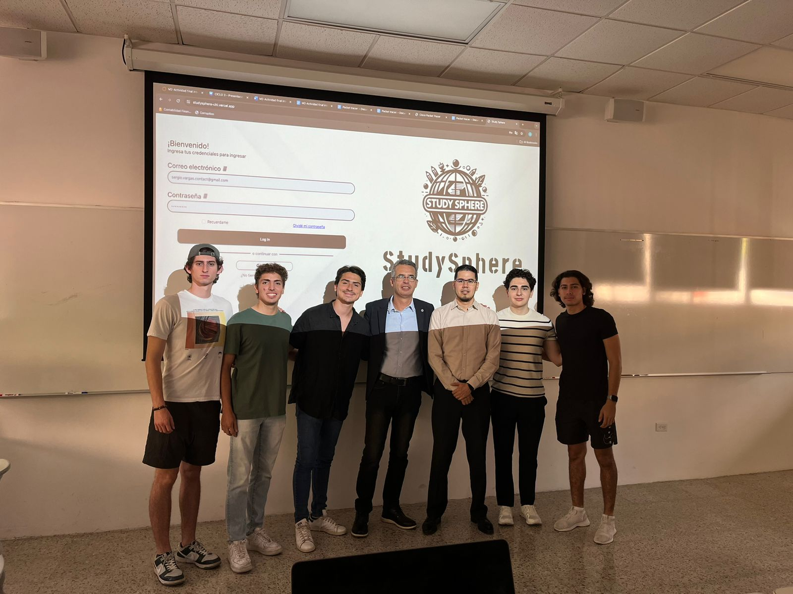

# StudySphere

  

## Overview: 
Developed a web app for WBAN Solution, the platform aims to motivate students through interactive avatars, real-time feedback, and a gamified environment that makes learning fun and dynamic. By incorporating adaptive AI, StudySphere offers tailored feedback and interactions that cater to individual learning styles and needs, addressing the specific challenges faced by WBAN Solution in enhancing student engagement and learning outcomes.

## Purpose

**StudySphere** was created with the goal of revolutionizing the educational experience by integrating modern technology to provide personalized, engaging, and effective learning. Developed for **WBAN Solution**, the platform aims to motivate students through interactive avatars, real-time feedback, and a gamified environment that makes learning fun and dynamic. By incorporating adaptive AI, StudySphere offers tailored feedback and interactions that cater to individual learning styles and needs, addressing the specific challenges faced by WBAN Solution in enhancing student engagement and learning outcomes.

## Key Features

* **Comprehensive Class Management:** The platform allows educators to manage classes, enroll students, and monitor their progress efficiently, all within a user-friendly interface.

* **Interactive Avatars and Gamification:** The platform features engaging avatars and gamified elements that make learning more enjoyable. Students earn points and badges, encouraging consistent participation and effort.
  
* **Personalized Learning:** Utilizing OpenAI, StudySphere adapts to each student's learning behavior, providing customized feedback and suggestions to enhance their learning experience.

* **Real-time Scoring and Feedback:** Quizzes and assignments are scored in real-time, allowing students to receive immediate feedback and track their progress instantly.

* **Astro Blast Game:** To help students manage stress, StudySphere includes a game called Astro Blast, developed with Unity and C#. This game provides a fun and engaging way for students to unwind and take a break from their studies.

## Technology Stack

 ### Front-end:
React: Designed an intuitive and dynamic front-end for streamlined user interaction.

### Back-end:
Node.js & Express.js: Built robust server-side APIs for real-time class management and quiz systems.

### Database:
PostgreSQL: Ensured secure and efficient data storage for students, classes, and quizzes.

### Hosting
Vercel: Deployed the platform, ensuring a reliable, scalable, and user-friendly web experience.

### AI Integration:
OpenAI: Delivered AI-driven, personalized feedback to enhance student engagement and learning.

### Game Development:
Unity & C#: Developed "Astro Blast," an engaging stress-management game to support student well-being.

## Contribution

### To WBAN Solution:

**StudySphere** was specifically designed to address **WBAN Solution's** need for an innovative educational platform that enhances student engagement and learning outcomes. Traditional educational methods often struggle to captivate students, resulting in decreased motivation and participation. StudySphere tackles this issue head-on by incorporating gamified elements and interactive avatars, transforming the learning process into an engaging and dynamic experience. The adaptive AI ensures that each student receives personalized feedback, catering to their unique learning needs and helping to close knowledge gaps more effectively.

### To Other Educational Institutions:

For schools and other educational institutions, StudySphere offers a comprehensive solution to streamline both teaching and administrative processes. The platform simplifies class management, student enrollment, and progress tracking, allowing educators to focus more on teaching and less on administrative tasks. Real-time scoring and feedback features enable teachers to monitor student performance continuously, identify areas where students struggle, and adjust their teaching strategies accordingly. Additionally, the inclusion of the Astro Blast game provides a valuable tool for schools to support student well-being by offering a fun way to relieve stress, promoting a healthier and more balanced learning environment.

 
## Login/Register
 

# Teacher's Perspective

## Menu/Profile Information/Add Class

  

  

## Ongoing Quizzes

  

## Quizzes Results

  

## Add Quiz

  

## Add Student

  

## Quiz Simulation

  

# Student's Perspective

## Menu/Profile Information

   

## Ongoing Quizzes

  

## Past Quizzes

  

## Quiz Simulator

  

  

## Astro Blast

  

## Tutor AI

  

## Team

  

## Collaborators

* **@ferp03**
* **@SofiaSchneider-dev**
* **@Alejandrocharles**
* **@mirelesDavid**
* **@mnoriega-mx**
* **@SergioVargasDev**
